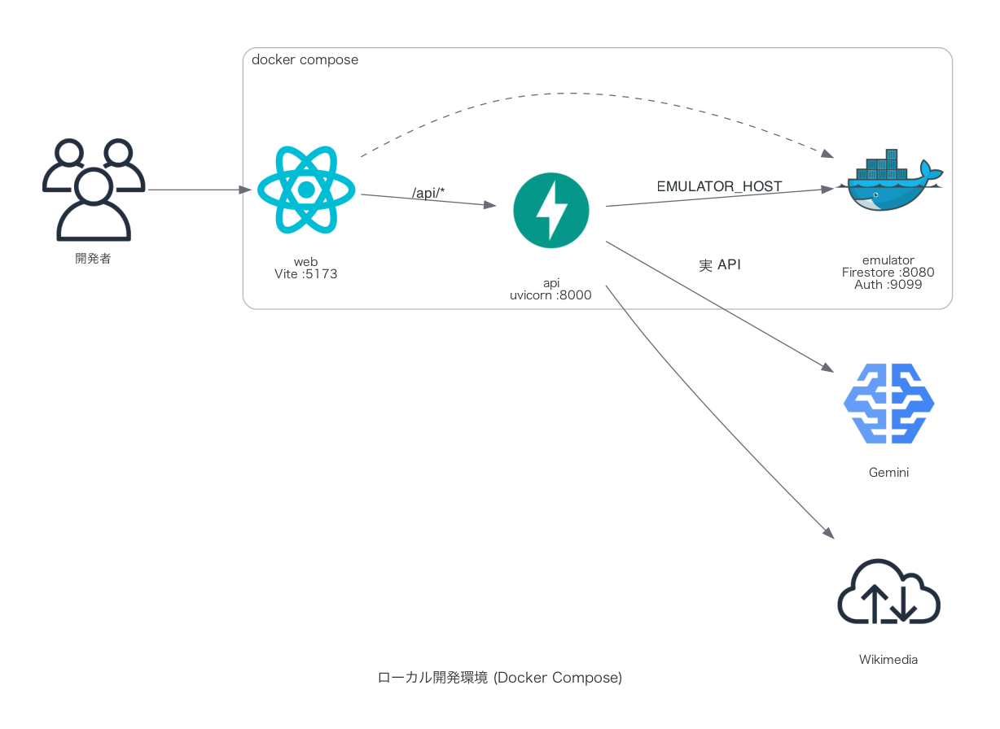

# 1分間予習クイズ Webアプリ 基本設計書

> このファイルが唯一の設計書。初版から、実装時に必ず詰まる箇所
> （正解の秘匿・フェーズ進行の駆動主体・配点スケール・Firestore ルール・ローカル環境）
> を確定させて統合した。初版からの変更点は §13 にまとめてある。
>
> **ここに書くのは「なぜそうしたか」だけ。** 手順は別ファイルにある。
> 遊びかたは [README.md](README.md)、開発手順は [CONTRIBUTING.md](CONTRIBUTING.md)、
> デプロイ手順は [DEPLOY.md](DEPLOY.md)。

## 1. 概要

Wikipedia 記事を「1分間予習」したのち、その内容に関するクイズへ**早押し**で対戦参加する Web アプリケーション。

**記事は1ゲームに1本だけ。** その1本を1分間予習し、そこから複数問（既定3問）を出す。
予習が1回で済むので、テンポよく続けて出題できる。
問題と選択肢が同時に出て、**最初に答えた1人だけ**が得点・失点する。
記事のプロパティ（PV数・被リンク数・記事内の数値規模）に基づいた**可変ポイントシステム**を
3つのゲームモードとして用意し、どの記事が出るかによって得点の桁が変わる。

対戦機能として、友人同士で遊べる**プライベートルーム機能**に加え、見知らぬプレイヤーと即座に対戦できる
**ランダムマッチング機能**、およびマッチング待ち時間を解消する**ボット参戦機能**を標準搭載する。

> **早押し方式であることの帰結**（初版の同時回答方式から変更）
> * 1問につき解答するのは1人。「全員の解答を一覧で開示する」画面は存在しない。
> * **「押す」ボタンは置かない。** 問題と同時に選択肢を出し、
>   最初に選んだ人の解答でそのまま確定する。押してから考える間が生まれず、
>   ふつうのオンラインクイズと同じ操作感になる。
> * 成立するのは1人だけなので、サーバー側で確定させる排他制御が要る。
> * 答えなかった人は加点も減点もされない。

### 参考動画（元ネタ）
* **YouTubeチャンネル**: [バキ童チャンネル【ぐんぴぃ】](https://www.youtube.com/@bakibakiDT)
* **企画1（予習クイズ）**: [【Wikipedia1分予習クイズ】バキ童VS大鶴肥満VS東大生の極限バトル！](https://www.youtube.com/watch?v=RWWp09sJ54I)
* **企画2（ポイントシステム元ネタ・数クイズ）**: [【数クイズ】桁違いの超インフレ！巨大な数字で一発逆転クイズバトル！](https://www.youtube.com/watch?v=33jR5YAt23g)

### 設計上の最重要原則

| # | 原則 | 理由 |
| :-- | :--- | :--- |
| P1 | **正解・他人の回答はクライアントに送らない** | Firestore を購読している以上、ドキュメントに入れた瞬間 DevTools で読める |
| P2 | **スコアと状態遷移の書き込みは 100% サーバー（Admin SDK）経由** | クライアント直書きを許すとスコア改竄が自明に可能 |
| P3 | **フェーズ進行 API は冪等**（`phaseSeq` によるトランザクション制御） | ゲームを進行させる常駐ループが存在せず、誰が叩くか分からないため。「誰が進めても同じ結果」でなければ破綻する |
| P4 | **リクエストの中で待たない** | 遅延はすべて「未来時刻の予約」としてデータに持たせ、表示側で解決する。15秒 sleep するとその間リクエスト枠を占有する |
| P5 | **インメモリの状態に依存しない** | Cloud Run は複数インスタンスへスケールしうる。真実は常に Firestore 側にある |
| P6 | **解答はサーバーのトランザクションで1人に確定させる** | 早い者勝ちの判定をクライアントの自己申告に任せると成立しない。到着順はサーバー受信時刻で決める |

---

## 2. システム構成・技術スタック

### アーキテクチャ

フロントエンドを Vercel、API を **Cloud Run**、リアルタイム同期を Firebase Firestore が担う。
API はコンテナなので、ローカルの Docker 環境がそのまま本番構成になる。


図は [`docs/architecture.py`](docs/architecture.py)（`diagrams` パッケージ）から生成する。

```bash
brew install graphviz && pip install diagrams
python docs/architecture.py
```

**データフローの向きが一方通行**である点が要。
クライアント → サーバー は REST のみ、サーバー → クライアント は Firestore 購読のみ。
クライアントは Firestore へ一切書き込まない。
図の点線（購読）が読み取り専用であること、そして正解を保持する
`rooms/{id}/private` へクライアントから到達する経路が存在しないことが、この設計の核。

### 技術スタック

| 区分 | 選定技術 | 採用理由・用途 |
| :--- | :--- | :--- |
| **フロントエンド** | React + Vite + TypeScript | SPA。SSR 不要（ゲーム画面は全てクライアント状態） |
| **バックエンド (API)** | **Python 3.12 + FastAPI**（Cloud Run） | Wikipedia 取得、クイズ生成、判定、フェーズ進行 |
| **データストア** | Firebase Firestore | **唯一の永続化層**。ルーム状態の即時同期を `onSnapshot` で行う |
| **認証** | Firebase Authentication（匿名認証） | uid を得てセキュリティルールの主体にする。サインアップ不要 |
| **AI (LLM)** | Google Gemini `gemini-3.8-flash`（`google-genai` SDK） | 問題生成、表記揺れ判定、ボット用誤答生成 |
| **状態管理** | Zustand | Firestore スナップショットの薄いラッパ |
| **ローカル環境** | Docker Compose（Firestore/Auth エミュレータ同梱） | 本番の Firestore を汚さずに開発する |
| **LP** | 静的 HTML（[`lp/`](lp/)） | ゲームの説明と導線。依存なしの1ファイル |
| **CI/CD** | GitHub Actions（Vercel CLI + `gcloud run deploy`） | main への Push で自動ビルド・デプロイ |

#### API を Cloud Run に置く理由

当初は Vercel の Python ランタイム（Serverless Functions）を検討したが、Cloud Run に変更した。

| | Vercel Python Functions | **Cloud Run（採用）** |
| :--- | :--- | :--- |
| バンドル制限 | 250MB。`firebase-admin` + `google-genai` で圧迫 | 実質なし |
| 実行時間 | `maxDuration` の引き上げが必要 | 最大 60 分。`start` の一括生成に余裕 |
| ローカルとの一致 | Docker はローカル専用で本番と別物 | **同じコンテナが本番でも動く** |
| コールドスタート | 毎リクエスト起動しうる | `min-instances=1` で常時待機にできる |
| Firestore 認証 | サービスアカウント JSON を環境変数に置く | **サービスアカウントを紐付けるだけ**（鍵ファイル不要） |

運用上の設定:

* `--min-instances=1`：コールドスタートを消す。個人開発の規模なら費用も小さい。
* `--concurrency=80`：I/O 待ち中心なので既定値のままで足りる。
* `--timeout=120s`：`start` が Gemini を 5 並列で叩くため、既定 300s より短くしてよいが
  60s では足りない可能性がある。
* Firestore へのアクセスは**サービスアカウントを Cloud Run サービスに紐付ける**（Workload Identity）。
  鍵ファイルを配布しないため、`FIREBASE_SERVICE_ACCOUNT` は本番では不要になる。

> フロントエンドは引き続き Vercel の静的ホスティング。
> ブラウザ → Cloud Run は**クロスオリジンになる**ため、CORS の許可オリジンに
> 本番ドメインとプレビュードメインを明示的に登録すること。

#### モデル選定

2026-09 時点の Flash 系最新は `gemini-3.8-flash`（GA）。
本アプリの用途（短い記事からの問題生成、表記揺れ判定）は長考を必要としないため、
**thinking level は `low`** に設定してレイテンシとコストを抑える。
`gemini-3.5-flash` も利用可能だが、3.6 → 3.7 → 3.8 と置き換わっているため新規採用しない。

### 環境変数

| 変数名 | 配置 | 用途 |
| :--- | :--- | :--- |
| `VITE_FIREBASE_*` | クライアント | Firebase Web SDK 初期化（公開前提の値） |
| `FIREBASE_PROJECT_ID` | 両方 | プロジェクト ID |
| `VITE_API_BASE_URL` | クライアント | Cloud Run のサービス URL |
| `CORS_ORIGINS` | サーバーのみ | 許可オリジン（Vercel の本番・プレビュードメイン） |
| `USE_MOCK` | サーバーのみ | `true`（既定）で固定問題。実データを使うときだけ `false` |
| `GEMINI_API_KEY` | サーバーのみ | Gemini 呼び出し。`USE_MOCK=false` のとき必須 |
| `GEMINI_MODEL` | サーバーのみ | 既定 `gemini-3.8-flash` |
| `WIKIMEDIA_USER_AGENT` | サーバーのみ | `WikiPreQuiz/1.0 (https://github.com/Syogo-Suganoya/wiki-prequiz)` — 本番では必須 |
| `FIRESTORE_EMULATOR_HOST` | ローカルのみ | 設定時は Admin SDK がエミュレータへ向く。**本番では未設定であること** |
| `FIREBASE_AUTH_EMULATOR_HOST` | ローカルのみ | 同上 |

> **注意1**: Wikimedia の API は識別可能な `User-Agent` がないと 403 を返す。連絡先を含む文字列を必ず設定する。
>
> **注意2**: `FIRESTORE_EMULATOR_HOST` が本番環境に残っていると、本番の API が
> 存在しないエミュレータに接続しようとして全機能が落ちる。デプロイ時のチェック項目にする。

#### モック判定

**`USE_MOCK` だけで決まる**（`Settings.is_mock`）。**既定は `true`。**

| `USE_MOCK` | 問題の出どころ | 予習スキップ | 必要な設定 |
| :--- | :--- | :--- | :--- |
| `true`（既定） | `mock_data` の固定問題 | 出る | なし |
| `false` | Wikipedia + Gemini | 出ない | `GEMINI_API_KEY` / `WIKIMEDIA_USER_AGENT` |

当初は「`GEMINI_API_KEY` の有無」で判定していたが、専用の変数に変えた。
キーの有無からの推測では、**「キーは検証用に置いてあるが実 API は呼びたくない」**
という意図が表現できない。逆に**「本番のつもりが、キー未設定で黙ってモックのまま動く」**
という事故も起こる。切り替えたい意図は、推測させずに変数として書く。

既定を `true` にしてあるのは、うっかり実 API を叩いて課金される事故のほうが
痛いため。実データを使うときだけ明示的に `false` にする。

切り替えの主体はサーバー。URL のクエリパラメータでは切り替えない。
クライアントが自称できてはいけないため。
クライアントは起動時に `GET /api/config` を読み、`mock` が真のときだけ
予習スキップなどの開発用操作を表示する。`POST /rooms/{id}/skip` は
サーバー側でも `is_mock` を検査し、モックでなければ 403 を返す。

`USE_MOCK=false` なのに必要な設定が欠けている場合は、`GET /api/health` の
`missing_for_real` に変数名が並ぶ。起動は通ってしまうので、ここで気づけるようにしておく。

---

## 3. クイズ形式・ゲームモード・ポイント設計

### クイズ形式（出題形式）

* **4択問題（`MULTIPLE_CHOICE`）**: LLM が生成した 4 つの選択肢から回答。サーバー側で自動採点。
* **自由記述形式（`FREE_TEXT`）**: テキスト直接入力。正規化による完全一致判定 → 不一致分のみ LLM で表記揺れ判定。

### ゲームモード（配点システム）

記事のプロパティから「その問題の配点」を決める。実数をそのまま合算すると桁が暴走するため、
**丸めと上限**を導入したうえでインフレ感は維持する。

| モード | 基礎値 `basePoint` の算出 |
| :--- | :--- |
| **① 固定点 `FIXED`** | 常に `1,000` |
| **② 人気度 `POPULARITY`** | `直近30日のPV合計 + 被リンク数 × 100` |
| **③ 最大数値 `MAX_NUMBER`** | 記事本文中で最大の「数量」（後述の抽出ルール）|

#### 得点計算式（早押し前提）

得点が動くのは**解答権を取った1人だけ**。押さなかった人は増減なし。

```
得点 = round2(basePoint) × 結果係数

round2(n) = 有効数字2桁に切り捨て   例: 123,456,789 → 120,000,000
                                      3,847      →       3,800

結果係数（settings.scoring / デフォルト値）
  正解      correctMul = +1.0
  誤答      wrongMul   = -1.0    ※正解と絶対値を揃える
  答えない  0           （増減なし）
```

**設計意図:**

* `round2` は「桁で殴り合う」という元ネタの快感を保ちつつ、端数の意味のない精度を捨てて表示を読みやすくする。
* **答えない選択に罰を与えない。** 早い者勝ちでは「答える」こと自体がリスクを取る行為であり、
  そこに賭けるかどうかがゲームの中心。答えない人まで減点すると、ただ全員が損をするだけになる。
* **正解と誤答の絶対値を揃える。** 得るものと失うものが同じ大きさなので、
  「確信があるか」だけで判断でき、係数を覚える必要がない。
  `MAX_NUMBER` で桁が大きいほど、賭ける重みがそのまま増す。
* 「押す」と「答える」を分けないため、押し得（とりあえず押して考える）は構造的に発生しない。
* これらは全て `settings.scoring` に持たせ、ルーム作成時に変更可能とする。

#### `MAX_NUMBER` の抽出ルール

正規表現による数値抽出は「1707年」「第2次」などのノイズを拾うため、**Gemini に構造化出力で抽出させる**。

* 対象: 人口・金額・距離・面積・質量・件数など**数量**を表すもの。
* 除外: 西暦・元号・順序数（第N回）・章番号・電話番号・型番。
* 上限: `1e15` を超える値は採用しない（天文学的数値による一発ゲーム終了の防止）。該当時は 2 番目に大きい値へフォールバック。
* 下限: 抽出結果が `1,000` 未満の場合は `1,000` を下限とする。
* 抽出失敗時は `FIXED` の 1,000 にフォールバック。

#### モードの選択

**ゲームモードは3種類あり、ホーム画面でどれか1つを選ぶ。既定は `FIXED`（固定点）。**
いちばん素直なルールなので、初めての人がそのまま始められる位置に置く。
選んだモードは全問を通して適用される。記事は1ゲームに1本なので、
**配点は全問で同じ**になる。

> ホーム画面のモード名の横に「!」ボタンを置き、押すと3モードの説明モーダルを出す。
> 初見の人がモードの意味を推測しなくて済むようにする。

モードごとに別のゲームとして成立させるのが狙い。
`MAX_NUMBER` は記事によって桁が大きく振れるので、それ自体が一つの遊び方になる。

---

## 4. マッチング & ボット参戦仕様

### 1人用モード

対戦相手を入れず、ロビーも挟まずにそのまま始める。
記事を1本読んで、自分のペースで答えるだけの練習用。

* **ボットも入れない。** 「ひとり」と言っておいて相手が出てくるのはおかしい。
* 早押しの排他制御はそのまま働く（常に自分が最初なので必ず成立する）。
* 「次の問題へ」は人間が自分ひとりなので、押した瞬間に次へ進む。
* 得点計算は対戦と同じ。ひとりでもスコアが残る。

専用の分岐はほとんど無く、**参加者が1人のルームを作って即開始するだけ**。
フェーズ制御も採点も対戦と同じ経路を通る。

### ⓪ ゲームルールの設定

対戦の中身は参加者が選ぶ。**置き場所は2つに分ける。**

| 項目 | 選択肢 | 既定 | 置き場所 |
| :--- | :--- | :--- | :--- |
| ゲームモード | 固定点 / 人気度 / 最大数値 | 固定点 | ホーム画面 |
| 問題数 | 1 / 2 / 3 問 | 3問 | **設定画面** |
| 予習時間 | 30 / 60 / 90 秒 | 60秒 | **設定画面** |

ゲームモードは得点の出かたが丸ごと変わる「遊びの種類」なので、遊ぶ直前に選べる位置に残す。
問題数と予習時間は一度決めたら毎回変えるものではないので、設定画面へ移す。
ホームには現在値（`3問 / 予習60秒`）だけを1行で出し、押すと設定画面へ入る。

**設定画面で決めた内容は `localStorage` に保存し、次に遊ぶときも引き継ぐ。**
毎回選び直させないため。保存に失敗しても既定値で遊べるようにしておく
（プライベートウィンドウなどで書き込めないことがある）。

選べる値は API 側の `ROUNDS_CHOICES` / `STUDY_SEC_CHOICES` を唯一の定義とし、
`GET /api/config` で配って画面に出す。範囲外の値はサーバーが 400 で弾く。
クライアントの表示と実際に通る値がずれないようにするため。

> 問題数の上限は、いまは固定問題が記事あたり3問しかないことに合わせてある。
> 記事から問題を生成するようになったら広げられる。

### ① マッチング方式

* **フレンド対戦**: 6桁のルームキー（英数大文字、紛らわしい `0/O/1/I` を除外した 32 文字から生成）または URL 共有。
* **マッチング**: **ルールが完全に一致する相手とだけ**引き合わせ、定員4人まで受け入れる。

#### 同じルールの相手とだけ合わせる

問題数や予習時間が食い違うと、そもそも同じ勝負にならない。
そこでルールを1本の文字列に畳んだ **`matchKey` = `{モード}:{問題数}:{予習ms}`** を鍵にする。

ルームには `openKey` フィールドを持たせ、**「募集中の公開ルーム」のときだけ `matchKey` を入れる**。
満室・開始・放置のいずれかで `null` に落とす。こうすると
`where("openKey", "==", key)` の**等値ひとつ**で引けるので、複合インデックスが要らない。

`POST /api/matchmake` の流れ:

1. `openKey == matchKey` のルームを最大10件引く。
2. `LOBBY` かつ定員未満、かつ**まだ人が待っている**ものへ参加する。
3. どれも該当しなければ、自分が公開ルームを立てて募集側になる。

参加はトランザクション内で人数を数えてから書くので、
最後の1席を同時に取り合っても定員4人を超えない。4人目が入った時点で `openKey` を落とす。

#### 放置されたルームを掴まないための TTL

途中で閉じられたルームが募集中のまま残ると、後から来た人がそこへ吸い込まれ、
誰も開始しないまま待たされる。そこで**最後に人を見かけてから45秒**（`OPEN_ROOM_TTL`）を過ぎた
ルームは候補から外し、見つけた人がその場で `openKey` を落として畳む。
掃除役の常駐プロセスを置かずに済ませるため、**通りがかった人が畳む**方式にしている。

待っているクライアントはマッチング中に `POST /rooms/{id}/heartbeat` を打ち続けるので、
本当に待っている人がいるルームは TTL で落ちない。

#### 開始は誰が叩いてもよい

待ち時間（5秒）が尽きたら、空席をボットで埋めて開始する。
**開始はホストに限定しない。** `start_game` は `LOBBY` 以外なら何もしないので、
同じルームの全員が叩いても実際に始まるのは1回だけ。
ホストだけに任せると、ホストが離脱したルームが永久に始まらなくなる。

### ② ボット参戦ロジック (AI Player)

#### 自動補填

待ち時間が尽きても人数が揃わない場合、不足枠にボットを補填する。
**この待ち時間はサーバーで待たない。** クライアントが締切を過ぎたことを検知して
`POST /api/rooms/{id}/fill-bots` を叩き、サーバーが冪等に補填する。
補填するボットは常に同じ順で選ぶので、複数人が同時に叩いても同じ ID が上書きされるだけで、
定員を超えることはない。

#### 何ミリ秒差で負けたかの算出

`POST /rooms/{id}/answer` は、負けた人に `behindMs` と相手の名前を返す。

* **時刻はトランザクションに入る前に取る。** 同時に押されるとトランザクションが
  競合して再試行が入るため、中で時刻を取ると「再試行に何秒かかったか」を
  測ってしまう。実際は横並びだったのに2秒差がついたように見えた。
* **解答権の判定は `status` より先に見る。** 解答が成立した瞬間に `REVEALING` へ
  移るので、僅差で負けた人の要求は「もう `ANSWERING` ではない」状態で届く。
  `status` を先に弾くと、いちばん差を知りたい人に何も返せない。
* **勝敗はトランザクションの確定順**で決まるので、到着が僅かに早くても負けうる。
  その場合 `behindMs` は 0 に丸める（ほぼ同着なので嘘にならない）。
* 解答時間より大きい差は表示しない。競り負けではなく「もう終わっていた」だけで、
  「21.98秒差で負けました」と出しても意味がない。

#### 解答タイミングのシミュレーション（サーバーで sleep しない）

`ANSWERING` に入った瞬間、サーバーは各ボットについて
**「答えるかどうか」と「何ミリ秒後に答えるか」を先に決めて予約する**。

```python
# ANSWERING 遷移時にサーバーが一度だけ実行する
for bot in bots:
    knows = random.random() < bot.accuracy          # 答えを知っているか
    if not knows and random.random() > bot.aggression:
        continue                                     # 分からないので答えない

    # 知っているほど速い。人間らしいばらつきを乗せる
    base = bot.reaction_ms if knows else bot.reaction_ms * 1.8
    at = phase_started_at + timedelta(milliseconds=random.gauss(base, 700))

    room["bots"][bot.id] = {"buzzAt": at, "knows": knows}
```

`buzzAt` は**公開領域に置いてよい**。正解そのものではないうえ、
先に見えていても人間が早く答えれば人間が勝つため、ゲーム性を壊さない。

クライアントは `buzzAt` を過ぎたボットを見つけたら `POST /api/rooms/{id}/bot-answer` を
代理で叩く。**成立の判定はあくまでサーバーのトランザクション**なので、
複数のクライアントが同時に代理送信しても結果は1つに定まる（P6）。

> これにより、対戦相手の「反応時間」を再現しながらサーバーは一切待たない。
> 人間が先に答えれば予約は破棄される。

#### ボットの解答

`knows` が真なら正解を、偽なら誤答候補から1つを選ぶ。
誤答候補 `botWrongAnswers` はクイズ生成時に Gemini へ一緒に作らせておくため、
**実行時の LLM 呼び出しはゼロ**。4択モードでは正解以外の選択肢をそのまま使う。

> **ボットであることを UI に出さない。** 名前は人間のプレイヤーと同じ体裁にし、
> 「AI」「BOT」といった表記もしない。待ち時間を消すための仕組みであって、
> 見せ物ではないため。

#### ボットのプロフィール

`accuracy` は正答率、`reactionMs` は押すまでの平均反応時間、
`aggression` は「分からなくても答える」確率。

| 名前 | 色 | accuracy | reactionMs | aggression | キャラクター |
| :--- | :--- | ---: | ---: | ---: | :--- |
| ゆうき | `--p1` | 0.60 | 2800 | 0.25 | 標準的 |
| みなと | `--p2` | 0.85 | 2200 | 0.10 | 速くて正確。分からない問題には手を出さない |
| あおい | `--p4` | 0.35 | 1500 | 0.60 | やたら速いが当たらない。場を荒らす |

> プレイヤーには**識別色**を割り当てる（元動画で出演者ごとに色が決まっているのに倣う）。
> 早い者勝ちでは「誰が答えたか」が一瞬で分かる必要があるため、色は装飾ではなく機能。

---

## 5. ゲームの進行フロー

### フェーズ状態機械

```
 LOBBY ──(start)──> GENERATING ──┐
                                  │ 記事1本と全問の生成完了
                                  ▼
                             STUDYING (60s)   ← 予習は1ゲームに1回だけ
                                  │
                                  ▼
                    ┌───────> ANSWERING (15s) ──┐
                    │                            │ 誰かが答えた / 時間切れ
       次の問題あり   │                            ▼
                    └──────────────────────  REVEALING (8s)
                                                 │ 次の問題なし
                                                 ▼
                                              FINISHED
```

| フェーズ | 既定時間 | 画面 | 記事本文 |
| :--- | ---: | :--- | :--- |
| `LOBBY` | — | 参加者一覧・設定 | — |
| `GENERATING` | 数秒 | ローディング（記事タイトルを先に表示して演出） | — |
| `STUDYING` | 60s（30/60/90 から選択） | 記事本文 + 時計 + 「この記事から◯問出ます」 | **表示** |
| ↑ この60秒のあいだに**作問が走る** | — | 出来るまでは「問題を準備しています」 | — |
| `ANSWERING` | 15s | 問題文・配点バッジ・選択肢。最初に選んだ人で確定 | **非表示（重要）** |
| `REVEALING` | 8s | 誰が何と答えたか・正解・解説・「次の問題へ」 | 非表示 |
| `FINISHED` | — | 順位表・**読んだ記事へのリンク** | — |

> `ANSWERING` で記事を隠すのが「予習」というゲーム性の根幹。

#### 作問は予習の裏で走らせる

記事の選定と作問を `start` の中でまとめてやると、**ゲーム開始を押した人だけが
数十秒待たされ、その間ほかの参加者には何も見えない**。そこで2段に分ける。

1. `POST /rooms/{id}/start` … 記事を1本決めて、すぐ `STUDYING` に入る（`quizReady: false`）
2. `POST /rooms/{id}/prepare-questions` … 予習中にクライアントが叩き、そこで作問する

* **担当はトランザクションで1つに絞る。** `quizClaimedAt` を立てた人だけが実際に生成する。
  全員のクライアントが叩いても、Gemini への呼び出しは1回だけ。
* **担当は45秒で失効する**（`QUIZ_CLAIM_TTL`）。担当した端末が落ちたまま
  誰も作らない、という状態を避けるため。
* **作問が終わるまで `STUDYING` から出さない。** 締切が来ても待つ。
  空の問題で出題フェーズへ入るくらいなら、予習が延びるほうがまし。
* 失敗したら担当を解放し、`quizError` に理由を残す。次の呼び出しでやり直せる。

記事の本文は作問に要るので `private/quizSet.extract` に持つ。
公開領域の `article.extract` は予習が終わると `null` にするため、そちらは使えない。

**「押す」フェーズを設けない理由**

当初は `BUZZING`（押す）と `ANSWERING`（答える）を分けていたが、統合した。

* 押しボタンを挟むと「とりあえず押して考える」が有利になり、それを潰すために
  時間切れペナルティという追加ルールが必要になる。ルールが増えるほど遊びにくい。
* 選択肢を最初から見せて最初に選んだ人で確定させれば、押し得は構造的に発生しない。
* 結果として**ふつうのオンラインクイズ対戦と同じ操作感**になり、
  「Wikipedia を1分だけ予習する」という部分だけが独自要素として際立つ。

15 秒のあいだ誰も答えなければ**流局**（全員 増減なし）して `REVEALING` へ進む。

> **1問につき解答は1回だけ。** 「誤答したら他の人に権利が移る」方式も検討したが、
> 1問あたりの時間が読めなくなり、ラウンドのテンポが崩れるため採用しない。

### フェーズ進行の駆動主体（v1 未定義箇所）

常駐サーバーがないため、以下の方式を採る。

1. サーバーはフェーズ遷移時に `phaseEndsAt`（`serverTimestamp` ベースの絶対時刻）と `phaseSeq`（単調増加整数）を書く。
2. 全クライアントはローカルでカウントダウンを表示し、`phaseEndsAt` を過ぎたら
   `POST /api/rooms/{id}/advance { expectedPhaseSeq }` を送る。
3. サーバーは Firestore トランザクションで
   * `room.phaseSeq === expectedPhaseSeq` か
   * `now >= phaseEndsAt - 1000ms`（早すぎる進行の拒否 / 1秒は時計誤差の許容）

   を検証し、満たす場合のみ遷移して `phaseSeq++`。満たさなければ `204 No Content` を返して黙って無視。

**結果**: 4 人が同時に叩いても遷移は 1 回だけ。誰か 1 人でも画面を開いていればゲームは進む。
全員が同時に切断した場合のみ停止するが、誰かが再接続すれば `phaseEndsAt` 超過を検知して復帰する。

### 時刻同期

クライアントのローカル時計は数秒ずれうるため、カウントダウンには補正済み時刻を使う。

* 初回接続時に `GET /api/time` を叩き、`serverNow - clientNow` のオフセットを保持（往復時間の半分を補正）。
* 表示残り時間 = `phaseEndsAt - (Date.now() + offset)`。

---

## 6. データ構造設計 (Firestore)

### コレクション構成

```
rooms/{roomId}                      公開状態。参加者は read のみ、write 不可
  ├── private/question              正解・解説。クライアントからは read すら不可
  ├── private/quizSet               全ラウンド分の生成済み問題（先読み）
  └── answers/{playerId}            自分の回答のみ read 可。write 不可

articles/{articleId}                記事キャッシュ（本文・PV・被リンク）
```

### ルームドキュメント (`rooms/{roomId}`) — 公開領域

```json
{
  "roomId": "K7M2XQ",
  "isPrivate": false,
  "status": "ANSWERING",
  "phaseSeq": 7,
  "phaseStartedAt": "2026-09-05T00:03:12.000Z",
  "phaseEndsAt": "2026-09-05T00:03:27.000Z",
  "hostId": "user_id_1",

  "settings": {
    "quizFormat": "MULTIPLE_CHOICE",
    "gameMode": "POPULARITY",
    "totalRounds": 5,
    "durations": { "studyMs": 60000, "answerMs": 15000, "revealMs": 8000 },
    "scoring": { "correctMul": 1.0, "wrongMul": -1.0 }
  },

  "currentRound": 2,
  "currentQuestion": {
    "articleTitle": "富士山",
    "articleUrl": "https://ja.wikipedia.org/wiki/富士山",
    "question": "この山が最後に噴火した年は西暦何年？",
    "choices": ["1707年", "1800年", "1603年", "1868年"],
    "basePoint": 84000,
    "pointBreakdown": { "pageviews": 62000, "backlinks": 220 },

    "correctAnswer": null,
    "explanation": null
  },

  "buzz": {
    "ownerId": null,
    "buzzedAt": null,
    "answeredAt": null,
    "answer": null,
    "isCorrect": null,
    "delta": null
  },

  "bots": {
    "bot_1": { "buzzAt": "2026-09-05T00:03:14.900Z" },
    "bot_3": { "buzzAt": "2026-09-05T00:03:13.400Z" }
  },

  "players": {
    "user_id_1": {
      "username": "Player1",
      "color": "p1",
      "isBot": false,
      "score": 1000,
      "lastSeenAt": "2026-09-05T00:03:20.000Z"
    },
    "bot_1": {
      "username": "ゆうき",
      "color": "p2",
      "isBot": true,
      "score": -500,
      "lastSeenAt": null
    }
  },

  "createdAt": "2026-09-05T00:00:00Z"
}
```

**`buzz` オブジェクトが解答記録の中心**

1問につき解答者は1人なので、プレイヤーごとに回答欄を持つ必要がない。
「誰が最初に答えたか」を表す `buzz` を1つ持つだけで足りる。

| フィールド | 意味 |
| :--- | :--- |
| `ownerId` | 最初に答えたプレイヤー。`null` ならまだ誰も答えていない |
| `buzzedAt` | サーバーが解答を受け付けた時刻（クライアント申告ではない） |
| `answer` / `isCorrect` / `delta` | `REVEALING` に入るまで `null` |

`bots.{botId}.buzzAt` は各ボットが答える予定時刻。公開してよい（§4 参照）。
人間が先に答えれば `ownerId` が埋まり、以降の予約はすべて無効になる。

**`null` フィールドの意味（P1 の実装）**

`currentQuestion.correctAnswer` / `explanation`、および `buzz.answer` / `isCorrect` / `delta` は
`ANSWERING` 中は必ず `null`。`REVEALING` へ遷移した瞬間にサーバーが
`private/question` と `answers/*` から値をコピーして初めて埋まる。
**締切前に正解や他人の回答が公開ドキュメントに存在しない**ことを保証する。

> ボットの `answeredAt` が「未来の時刻」になっている点に注意（§4 参照）。
> `hasAnswered` はボットには使わず、クライアントが `answeredAt <= now` で判定する。

### 非公開ドキュメント (`rooms/{roomId}/private/quizSet`)

```json
{
  "questions": [
    {
      "round": 1,
      "articleTitle": "富士山",
      "gameMode": "FIXED",
      "question": "この山が最後に噴火した年は西暦何年？",
      "choices": ["1707年", "1800年", "1603年", "1868年"],
      "correctAnswer": "1707年",
      "explanation": "宝永大噴火は1707年12月16日に発生しました。",
      "evidence": "宝永大噴火（1707年）が最後の噴火である",
      "botWrongAnswers": ["1800年", "1603年", "1868年"],
      "basePoint": 1000
    }
  ]
}
```

`evidence` は記事本文からの引用。生成後にサーバーが**本文に実際に含まれるか検証**し、
含まれなければその問題を破棄して再生成する（ハルシネーション対策）。

### 回答ドキュメント (`rooms/{roomId}/answers/{playerId}`)

```json
{
  "round": 2,
  "answer": "1707年",
  "submittedAt": "2026-09-05T00:03:18.000Z",
  "isBot": false
}
```

### 記事キャッシュ (`articles/{articleId}`)

```json
{
  "title": "富士山",
  "extract": "富士山（ふじさん）は、静岡県と山梨県にまたがる…",
  "charCount": 8420,
  "pageviews30d": 62000,
  "backlinks": 220,
  "maxNumber": { "value": 3776, "context": "標高3776m" },
  "fetchedAt": "2026-09-04T12:00:00Z"
}
```

`fetchedAt` から 24 時間以内ならキャッシュを再利用し、Wikimedia API を叩かない。

### Firestore セキュリティルール（v1 未定義箇所）

```js
rules_version = '2';
service cloud.firestore {
  match /databases/{database}/documents {

    // ルーム公開状態: 参加者のみ読める。書き込みは Admin SDK のみ（＝ここでは全拒否）
    match /rooms/{roomId} {
      allow read: if request.auth != null
                  && request.auth.uid in resource.data.players;
      allow write: if false;

      // 正解・問題セット: クライアントからは読むことすらできない
      match /private/{doc} {
        allow read, write: if false;
      }

      // 回答: 自分のものだけ読める
      match /answers/{playerId} {
        allow read: if request.auth != null && request.auth.uid == playerId;
        allow write: if false;
      }
    }

    match /articles/{articleId}  { allow read, write: if false; }
  }
}
```

Admin SDK はセキュリティルールをバイパスするため、サーバー側の書き込みは影響を受けない。
`allow write: if false` を全面適用することで、スコア改竄の経路を構造的に断つ。

### データのライフサイクルと運用

Firestore を唯一のデータストアとするため、掃除とインデックスを設計に含めておく。

| コレクション | 寿命 | 掃除方法 |
| :--- | :--- | :--- |
| `rooms/{id}`（+ サブコレクション） | 24 時間 | `expiresAt` フィールドに **Firestore の TTL ポリシー**を設定して自動削除 |
| `articles/{id}` | 永続 | 手動バッチで補充。`fetchedAt` が 24h より古ければ指標のみ再取得 |

> サブコレクション（`private` / `answers`）は親ドキュメントを消しても**自動では消えない**。
> TTL 削除だけに任せず、`FINISHED` 遷移時にサーバーが `private` を明示的に削除する。
> 正解データを必要以上に残さないという意味でも有効。

必要なコンポジットインデックスは [`firebase/firestore.indexes.json`](firebase/firestore.indexes.json) に定義する。

* `articles`: `enabled` + `charCount` + `randomKey`（記事プールからのランダム抽出）
* `rooms`: `status` + `createdAt`（放置ルームの掃除）

`randomKey` は記事登録時に `0〜1` の乱数を入れておくフィールド。
`where(randomKey >= X).limit(n)` で Firestore でも安価にランダム抽出できる
（`ORDER BY RANDOM()` に相当する機能が Firestore にないため）。

### プレゼンス（切断検知）

Firestore には Realtime Database のような `onDisconnect` がない。

* クライアントは 5 秒ごとに `POST /api/rooms/{id}/heartbeat` を送り、サーバーが `lastSeenAt` を更新。
* `now - lastSeenAt > 30s` のプレイヤーはクライアント側で「切断中」と灰色表示。
* **ゲームは止めない。** 切断者は無回答扱い（`noAnswerMul` 適用）。
* リロード時は `localStorage` の `{ playerId, roomId, sessionToken }` で復帰。`sessionToken` は
  join 時にサーバーが発行し、以後の API 呼び出しの本人確認に使う（Firebase 匿名認証の ID トークンで代替可）。

---

## 7. API 設計

全エンドポイントは Vercel Functions。認証は Firebase 匿名認証の ID トークンを
`Authorization: Bearer <idToken>` で受け取り、Admin SDK で検証する。

| メソッド / パス | 用途 |
| :--- | :--- |
| `GET  /api/time` | サーバー時刻。時計オフセット計測用 |
| `POST /api/rooms` | ルーム作成。ルームキーを発行 |
| `POST /api/rooms/{id}/join` | 入室。`players` に追加 |
| `POST /api/rooms/{id}/leave` | 退室 |
| `POST /api/rooms/{id}/start` | 記事を1本決めて `STUDYING` へ（作問はまだ） |
| `POST /api/rooms/{id}/prepare-questions` | 予習中に作問する。担当は1つだけ |
| `POST /api/rooms/{id}/advance` | フェーズ進行（冪等） |
| `POST /api/rooms/{id}/answer` | **解答**（最初の1人だけ成立） |
| `POST /api/rooms/{id}/bot-answer` | 対戦相手の解答をクライアントが代理送信 |
| `POST /api/rooms/{id}/ready` | 開示画面の「次の問題へ」。全員そろえば締切を待たず進む |
| `POST /api/rooms/{id}/heartbeat` | プレゼンス更新 |
| `POST /api/rooms/{id}/fill-bots` | 空席をボットで埋める（冪等） |
| `POST /api/matchmake` | 同じルールで募集中のルームへ入る。無ければ立てる |
| `GET /api/config` | モックか否か、選べるルールの一覧 |
| `POST /api/rooms/{id}/skip` | 現フェーズの締切を今にする。**モック時のみ** |

### `POST /api/rooms/{id}/start`

1. 記事プールから `totalRounds` 件をランダム抽出（重複なし）。
2. 各記事について、キャッシュがなければ Wikipedia / Wikimedia API から並列取得。
3. Gemini に**全ラウンド分を並列で**投げ、構造化出力で問題を生成。
4. `evidence` の本文照合を実施。失敗した問題は 1 回だけ再生成し、それでも失敗ならフォールバック問題集から充当。
5. `private/quizSet` へ保存し、Round 1 の公開情報のみ `rooms/{id}` に反映して `STUDYING` へ遷移。

> **全ラウンド分をここで作りきる**のが重要。ラウンドごとに生成すると、毎ラウンド数秒の
> 待ちが挟まってテンポが死ぬ。待たせるのは開幕の 1 回だけにする。

### `POST /api/rooms/{id}/advance`

```
Request:  { expectedPhaseSeq: number }
Response: 200 { status, phaseSeq }  /  204 (既に進行済み・時刻未到達)
```

遷移時の処理:

| 遷移 | サーバー処理 |
| :--- | :--- |
| `STUDYING → ANSWERING` | 記事本文を公開領域から除去。ボットの `buzzAt` を予約（§4） |
| `ANSWERING → REVEALING` | 15秒誰も答えなければ**流局**（スコア据え置き）。誰かが答えた場合は採点して即遷移 |
| `REVEALING → STUDYING` | 次ラウンドの問題を `quizSet` から公開領域へ展開。`buzz` / `bots` / `ready` をリセット |
| `REVEALING → FINISHED` | 最終順位を確定 |

### `POST /api/rooms/{id}/answer`

このゲームの中核。**Firestore トランザクションで最初の1人だけを成立させる。**

```
Request:  { round: number, answer: string }
Response: 200 { accepted: true }   自分の解答で確定した
          200 { accepted: false }  先に他の人が答えていた
```

```python
@firestore.transactional
def claim(tx, room_ref, player_id):
    room = room_ref.get(transaction=tx).to_dict()
    if room["status"] != "ANSWERING" or room["currentRound"] != round_:
        return False
    if room["buzz"]["ownerId"] is not None:
        return False                      # 先に答えられた
    tx.update(room_ref, {
        "buzz.ownerId":  player_id,
        "buzz.buzzedAt": SERVER_TIMESTAMP,
    })
    return True
# 成立した場合のみ、採点して REVEALING へ進める
```

* **到着順はサーバー受信時刻**で決める。クライアント申告の時刻を信用すると、
  「0ms で答えた」と詐称できてしまう。
* 成立しなかった側には `accepted: false` を返すだけで、正誤は一切漏らさない。
* `bot-answer` はボットの代理送信用。`bots[botId].buzzAt <= now` をサーバー側で検証し、
  予定より早い代理送信を弾く。これがないとクライアントがボットを操作できてしまう。

### `POST /api/rooms/{id}/ready`

開示画面の「次の問題へ」。`ready.{uid}` を立て、**人間の参加者が全員押したら**
`advance(force=True)` で締切を待たずに次のラウンドへ進める。

* ボットは待たせる意味がないので、最初から準備済みとみなす（判定対象は人間だけ）。
* `force=True` が飛ばすのは**締切の判定だけ**で、`phaseSeq` による冪等性は維持する。
  そうしないと、遅れて届いたリクエストが次のラウンドまで飛ばしてしまう。
* 誰も押さなくても 8 秒で自動的に進む。待たされ続ける状態を作らない。

### 採点処理（`ANSWERING → REVEALING` 内）

早押しなので**採点対象は常に1件**。初版の「全員分をまとめて判定」は不要になった。

```
1. 成立した解答を取得（誰も答えなければ流局でスキップ）
2. MULTIPLE_CHOICE  → 文字列一致で即判定
   FREE_TEXT        → ① 正規化（NFKC・小文字化・空白/記号除去・カタカナ→ひらがな）して完全一致
                      ② 一致しなければ Gemini で表記揺れ判定（1回）
3. delta = round2(basePoint) × (correctMul | wrongMul)
4. players[ownerId].score += delta をトランザクションで更新
   ※ 押さなかったプレイヤーのスコアは触らない
```

> 判定が1件で済むのは早押し方式の副次的な利点。
> Gemini 呼び出しは1ラウンドあたり最大1回（4択なら0回）に収まる。

---

## 8. 外部 API 利用仕様

### Wikipedia / Wikimedia

| 用途 | エンドポイント | 備考 |
| :--- | :--- | :--- |
| 本文取得 | `ja.wikipedia.org/w/api.php?action=query&prop=extracts&explaintext=1&titles=...` | `exintro` は付けない（全文が必要） |
| PV数 | `wikimedia.org/api/rest_v1/metrics/pageviews/per-article/ja.wikipedia/all-access/user/{title}/daily/{s}/{e}` | **集計に 1〜2 日の遅延**。終端は `today - 2d` にする |
| 被リンク | `api.php?action=query&list=backlinks&bltitle=...&bllimit=max` | 1 リクエスト上限 500。**継続せず 500 でクリップ**（近似で十分） |
| 人気記事 | `wikimedia.org/api/rest_v1/metrics/pageviews/top/ja.wikipedia/all-access/{date}` | 記事プールの種として使用 |

**注意点**

* `User-Agent` に連絡先を含めないと 403。
* 被リンクの全件カウントは重い。500 件でクリップし、`backlinks × 100` として PV とスケールを揃える。
* PV が 0 の記事（新規・極端にマイナー）は `basePoint` が下限 1,000 に落ちるようクランプする。

### 記事プールの構築（ランダム記事を直接使わない理由）

`action=query&list=random` はスタブ記事・曖昧さ回避ページ・一覧記事を大量に引く。
これらは 60 秒予習の題材として成立しない。

**方針**: バッチ（GitHub Actions の定期実行 or 手動スクリプト）で以下の条件を満たす記事を
数百件収集し、`articles` コレクションにプールしておく。

* 本文 2,000 字以上 20,000 字以下（短すぎ＝問題が作れない / 長すぎ＝60秒で読めない）
* タイトルに「一覧」「曖昧さ回避」を含まない
* 直近 30 日 PV が 1,000 以上（誰も知らない記事だと問題が成立しない）
* カテゴリの偏りを避けるため、人物 / 地理 / 作品 / 科学 / 歴史 などから均等にサンプリング

これによりゲーム中の Wikipedia API 呼び出しは実質キャッシュ参照のみになり、
`start` のレイテンシが大幅に下がる。

### Gemini

* モデル: `gemini-3.8-flash`（SDK は `google-genai`。旧 `google-generativeai` は使わない）
* **thinking level は `low`**。記事1本からの作問・表記揺れ判定に長考は不要で、
  既定のままだとレイテンシとコストが無駄に増える。
* **構造化出力（`responseSchema`）を必ず使う**。Pydantic モデルをそのまま渡し、
  JSON パース失敗のリトライを設計から排除する。
* 1 ゲームあたりの呼び出し: 問題生成 5 回（並列） + 自由記述判定 最大 5 回 = **10 回程度**。
* 生成プロンプトの制約:
  * 記事本文に明示的な根拠がある問題のみ作る。`evidence` に根拠の原文をそのまま抜粋させる。
  * 選択肢は同一カテゴリ・同程度の文字数（正解が最長になる典型的リークの防止）。
  * 生成後、サーバー側で選択肢を必ずシャッフルする（LLM は先頭に正解を置きがち）。
* **フォールバック**: 生成が全滅した場合に備え、固定の問題セット（10問程度）をリポジトリに同梱する。
  デモ中に API が落ちてもゲームが成立する保険。

---

## 9. 画面 (UI/UX) 設計方針

### 画面一覧

| 画面 | 主要素 |
| :--- | :--- |
| **トップ** | ニックネーム、ゲームモード、現在の設定（`3問 / 予習60秒`）、「マッチング」「フレンド対戦」の 2 ボタン |
| **設定** | 問題数・予習時間。`localStorage` に保存して次回へ引き継ぐ |
| **ロビー** | 参加者一覧、開始ボタン。**ルームキーはフレンド対戦の部屋にだけ出す** |
| **マッチング待機** | 「対戦相手をさがしています → マッチングしました → まもなくゲームを開始します」を順に表示し、そのまま開戦。選んだルールを併記する |
| **予習** | 右上にアナログ時計の針、中央に記事本文（ここだけスクロール可）、上部に配点バッジ |
| **解答** | 問題文、**配点バッジ**（`+84,000 / −84,000`）、選択肢。最初に選んだ人で確定 |
| **開示** | 誰が何と答えたか、正解、解説、**「次の問題へ」ボタン** |
| **結果** | 順位表、最大逆転ラウンドのハイライト、リマッチボタン |

### 演出上のポイント

* **配点バッジ**は解答フェーズの主役。`MAX_NUMBER` で `+120,000,000` が出た瞬間の緊張感がゲームの山場。
  数値はカンマ区切り + カウントアップアニメーションで見せる。
* **スコアバー**は対数スケール表示を推奨。線形だと最終ラウンドで下位が全員ゼロ幅になり潰れる。
* **予習フェーズの残り 10 秒**で色を変える／振動させ、焦りを演出する。
* **ボットであることを一切表示しない**（§4）。名前も挙動も人間の参加者と同じ扱いにする。
* **残り時間はアナログ時計の針1本**で見せる。数字を読ませるより、
  回っていく針のほうが焦りが伝わる。残り5秒で色を赤に変える。
  文字盤の円と針だけを描き、**目盛りと中心の点は置かない**（十字が入ると照準に見える）。
  針は文字盤の中心を軸に回す（`transform-box:view-box` + `transform-origin:20px 20px`）。
* **ルームキーはフレンド対戦のロビーだけ。** プレイ中のヘッダーには出さないし、
  マッチングで入った部屋では最初から出さない。誰かを呼ぶための道具なので、
  相手が自動で決まる導線には用がない。判定は `room.isPrivate` で行う。
* **最終結果に読んだ記事へのリンクを置く。** 答えられなかった問題の答えが載っているので、
  遊んだあとにそのまま読み返せる導線にする。
* **得点は画面下部に固定**する。誰がいくつ持っているかは常に見えている必要がある。
* **favicon は LP とアプリで同一ファイルにする。** `web/public/` の3点は `lp/` からの複製。
  タブに並んだときに同じ product だと分かる必要があるので、片方だけ差し替えられないよう
  意図的に揃えている（差し替えるときは両方）。`theme-color` はアプリ側だけ上部バーと
  同じ黒（`#16161C`）にする。スマホでブラウザの枠と地続きに見せるため。
* **選択肢は親指で押せる大きさ**にする。スマホで遊ぶ以上、ここが小さいと勝負にならない。
* **選択肢は色と形の両方で見分ける**（丸・三角・四角・菱形）。色だけで区別すると
  色覚特性のある人が選び違える。Kahoot が同じ理由で4つの形を使っている。
  記号の中の数字はキーボードの割り当てと同じにして、覚えることを1つに減らす。
* **数字キー 1〜4 で解答できる。** 早押しは指の速さを競うのに、
  入力手段がタップだけだと PC の人が構造的に不利になる。
* **競り負けた人には何秒差だったかを見せる。** 差が見えないと
  「押せなかった」だけで終わり、勝負として成立しない。
  表示は**開示画面**で行う。解答が成立した瞬間に画面が切り替わるので、
  出題画面に出そうとすると、返事が届くころには画面が消えている。
* **マッチングはルームキーの入力も開始ボタンも挟まない。** 「対戦相手をさがしています」→
  「マッチングしました」→「まもなくゲームを開始します」と表示して、そのまま始める。

### モバイル対応

60 秒で記事を読む都合上、**スマホでの本文可読性が体験の生命線**。

* 本文は最低 16px、行間 1.8。ダークモード対応。
* 縦スクロール以外の操作を予習中は一切要求しない。
* 解答欄は画面下部固定（キーボード表示時もタップ可能な位置）。

---

## 10. ローカル開発環境 (Docker Compose)

本番の Firestore を汚さずに開発するため、**Firebase エミュレータをコンテナに同梱**する。



### サービス構成

| サービス | 中身 | ポート |
| :--- | :--- | :--- |
| `emulator` | Firestore + Auth エミュレータ + Emulator UI | 8080 / 9099 / 4000 |
| `api` | FastAPI（`uvicorn --reload`） | 8000 |
| `web` | Vite dev server（HMR） | 5173 |

### 起動手順

```bash
cp .env.example .env
docker compose up
```

具体的な手順・確認コマンド・詰まりやすい箇所は [CONTRIBUTING.md](CONTRIBUTING.md) にまとめてある。
ここでは**なぜその構成にしたか**だけを記す。

### 設計上のポイント

* **エミュレータの切り替えは環境変数だけで行う。** `FIRESTORE_EMULATOR_HOST` と
  `FIREBASE_AUTH_EMULATOR_HOST` が設定されていれば Admin SDK と Web SDK が
  自動的にエミュレータへ向く。アプリケーションコードに分岐を書かない。
* **エミュレータには JDK 21 以上が必要。** Firestore エミュレータは JVM 上で動き、
  最近の `firebase-tools` は Java 17 を拒否する。ベースイメージは `node:22-trixie-slim`
  に `openjdk-21-jre-headless` を入れる（bookworm 系の `default-jre` は Java 17 で起動失敗する）。
* **データは named volume に永続化する。** `--export-on-exit` / `--import` で、
  `docker compose down` を挟んでも記事プールや作りかけのルームが残る。
  初回は保存データがないため、`--import` を条件付きで付ける
  （[`firebase/start-emulators.sh`](firebase/start-emulators.sh)）。
* **Gemini と Wikimedia にはエミュレータがない。** ローカルでも実 API を叩くので、
  API キーと User-Agent の設定は開発時点から必須。記事キャッシュ（`articles`）が
  効くため、実際の Wikimedia 呼び出しは初回のみ。
* **`node_modules` / `.venv` は匿名ボリュームで保護する。** ソースをバインドマウント
  すると、ホスト側の空ディレクトリがコンテナ内の依存関係を覆い隠してしまうため。

### 本番との差分

| | ローカル | 本番 |
| :--- | :--- | :--- |
| API 実行形態 | Docker Compose（uvicorn --reload） | **Cloud Run（同じイメージの prod ステージ）** |
| Firestore | エミュレータ | 本番 Firestore |
| 認証 | Auth エミュレータ | Firebase Authentication |
| 資格情報 | 不要（匿名） | サービスアカウントの紐付け（鍵ファイルなし） |
| フロントエンド | Vite dev server | Vercel（静的配信） |

> API をコンテナで揃えたことで、**ローカルで動いたものがそのまま本番で動く**。
> 差分は Firestore がエミュレータか本番かだけで、それも環境変数 2 つで切り替わる。
>
> ただし Cloud Run は複数インスタンスにスケールしうるため、**インメモリの状態に依存しないこと**。
> 設計上フェーズ進行はすべて Firestore 側の `phaseSeq` で決まるので問題にはならない。

---

## 11. CI/CD パイプライン設計 (GitHub Actions)

Workflow は [`.github/workflows/`](.github/workflows/) に2つ。
**設定手順と Secrets の一覧は [DEPLOY.md](DEPLOY.md) にある。** ここには方針だけを書く。

| Workflow | 契機 | 内容 |
| :--- | :--- | :--- |
| `ci.yml` | Push / PR | `ruff` → `mypy` → `pytest`（エミュレータ上） / `tsc` → `build` |
| `cd.yml` | `main` への Push（**現在は停止中**） | Firestore ルール → Cloud Run → Vercel の順にデプロイ |

* **CD は当面オフにしておく。** `cd.yml` の契機は `workflow_dispatch` だけにしてある。
  デプロイ先が用意できていない段階で自動デプロイを繋ぐと、失敗通知が出続けるだけで
  何の役にも立たない。手動実行で通ることを確かめてから `push:` を開ける。
* **ルールを最初に出す。** Firestore ルール → API → フロントの順に流す。
  逆順にすると、ルールが古いまま新しい API が動く時間帯ができてしまう。
  ルールは「クライアントからの書き込みを全面禁止」という設計の実体そのものなので、
  コード管理下に置き、手動デプロイに頼らない。
* **認証は Workload Identity 連携。** サービスアカウント鍵を GitHub Secrets に置かない。
  鍵を発行すると、漏れたときに失効させる以外の手段がなくなる。
  連携には `attribute-condition` でリポジトリを限定する。付け忘れると
  **他人のリポジトリからも**同じプールを使えてしまう。
* **テストはエミュレータ上で実行する。** CI でも `docker compose up -d --wait emulator` を使い、
  本番 Firestore に触れずに `pytest` を回す。セキュリティルールのテストもここで担保する。
* **デプロイ直後に `/api/health` を叩いて検証する。** `using_emulator` が `false` で
  あることを確かめる。`FIRESTORE_EMULATOR_HOST` が本番に紛れ込むと全機能が落ちるが、
  デプロイ自体は成功してしまうため、Workflow 側で気づけるようにしておく。
* **パスフィルタ**: `web/**` の変更で Cloud Run を再デプロイしないよう、
  ジョブごとに変更範囲を見て振り分ける。

---

## 12. 実装スコープ（優先度）

### 現在の実装状況（モック段階・動作確認済み）

`docker compose up` で **1ゲームを最後まで遊べる状態**まで実装済み。
Wikipedia と Gemini は呼ばず、[`api/app/mock_data.py`](api/app/mock_data.py) の
固定記事5本を使う。データ構造とフェーズ制御は本設計書どおり。

| 項目 | 状態 |
| :--- | :--- |
| ルーム作成・参加・ルームキー | ✅ |
| ボット3体の参戦（識別色つき） | ✅ |
| `STUDYING`（記事表示）→ `ANSWERING`（記事を隠す） | ✅ |
| 早い者勝ちの排他制御（同時解答で1人だけ成立） | ✅ 4並列で検証済み |
| 選択肢の色＋形＋番号 | ✅ |
| 数字キー 1〜4 での解答 | ✅ |
| 競り負けたときの秒差表示 | ✅ |
| ボットの `buzzAt` 予約と代理解答 | ✅ |
| モック判定を環境変数へ（`GEMINI_API_KEY` の有無） | ✅ |
| ゲームルールの設定（モード・問題数・予習時間） | ✅ |
| 同じルールの相手とのマッチング（`openKey` + TTL） | ✅ |
| 設定画面（問題数・予習時間、`localStorage` に保存） | ✅ |
| 「次の問題へ」（全員押下で即遷移 / 8秒で自動） | ✅ |
| 1周するアナログ時計のタイマー | ✅ |
| マッチング演出からの自動開始 | ✅ |
| 3モードの配点（`FIXED` / `POPULARITY` / `MAX_NUMBER`）とその説明モーダル | ✅ |
| 記事1本から複数問の出題 | ✅ |
| 予習中の作問（担当を1つに絞る・TTL付き） | ✅ |
| 1人用モード | ✅ |
| 最終結果の記事リンク | ✅ |
| LP 用スクリーンショットの自動撮影（`--profile shots`） | ✅ |
| 正解の秘匿（`private/quizSet`） | ✅ |
| 流局（誰も答えない） | ✅ |
| 結果画面・順位 | ✅ |
| Firestore 直接購読（`onSnapshot`） | ⏳ モックは API ポーリングで代用 |
| Firebase 匿名認証 | ⏳ `X-Player-Id` ヘッダで代用 |
| Wikipedia 取得（本文・PV・被リンク・人気記事） | ✅ 実データで疎通確認済み |
| 記事キャッシュ（24時間）と記事プール | ✅ |
| Gemini による作問・最大数値抽出 | ⚠️ 実装済み。**実 API 呼び出しは未検証**（キー未設定のため） |

> モックで代用している2点（購読・認証）は、いずれも
> **サーバー側のゲームロジックに手を入れずに差し替えられる**ように分離してある。
> 記事の取得元は `app/content.py` に閉じてあり、`game.py` はどちらから来たかを知らない。

### LP 用スクリーンショットの撮影

**利用者と同じ順に画面を操作しながら**撮るので、画面を変えたら撮り直すだけで
LP の図版が追随する。手順は [CONTRIBUTING.md](CONTRIBUTING.md) を参照。


ハッカソンの限られた時間で「動くデモ」を確実に作るための優先順位。

### MVP（これがないとデモが成立しない）

1. 匿名認証 + プライベートルーム（ルームキー）
2. 記事プール（手動で 30 件程度用意すれば十分）
3. Gemini による 4 択問題生成 + `evidence` 検証
4. STUDYING → ANSWERING → REVEALING の 1 ラウンド完走
5. `advance` の冪等実装と `phaseSeq`
6. 正解の非公開化（`private/question`）と Firestore ルール
7. `FIXED` + `POPULARITY` モード

### 第2優先（デモの見栄えに直結）

8. `MAX_NUMBER` モードと最終ラウンドの逆転演出
9. ボット参戦（`buzzAt` 予約方式・UIには出さない）
10. 5 ラウンド通し + 結果画面
11. スコアバーのアニメーション

### ストレッチ

12. ランダムマッチング
13. 自由記述モードと LLM 表記揺れ判定
14. 解答前の「賭ける / 降りる」ベット選択（逆転性をさらに強化）
15. リマッチ、戦績の永続化

---

## 13. 初版からの主な変更点

| # | 初版 | 現行 | 理由 |
| :-- | :--- | :--- | :--- |
| 1 | `correctAnswer` を公開ドキュメントに保持 | `private/question` に分離 | DevTools で正解が読めてしまう |
| 2 | 他プレイヤーの回答が常時見える | `answers/{playerId}` を本人のみ read 可 | 締切前のカンニング防止 |
| 3 | セキュリティルール未定義 | 全 write 禁止 + Admin SDK 経由 | スコア改竄の防止 |
| 4 | フェーズ進行の主体が未定義 | `phaseSeq` による冪等 `advance` API | 常駐サーバーがないため必須 |
| 5 | ボットを 3〜15 秒 sleep で実装 | `answeredAt` を未来時刻で予約 | サーバーレスで待つのは課金・タイムアウト面で不可 |
| 6 | `PV数 + 被リンク数` の生値 | 有効数字 2 桁 + 被リンク×100 + 上限/下限 | 桁スケールの不整合と一発ゲーム終了の防止 |
| 7 | 誤答は常に同額マイナス | 4択 `-0.5` / 記述 `-1.0` / 無回答 `-0.25` | 同額だと「答えないのが最適」になり成立しない |
| 8 | 問題をラウンドごとに生成 | 開幕時に全ラウンド一括生成 | 毎ラウンドの生成待ちでテンポが死ぬ |
| 9 | 記事はランダム抽出 | 事前キュレーションした記事プール | スタブ・曖昧さ回避ページの混入防止 |
| 10 | 解答フェーズの記事表示が未定義 | **非表示**と明記 | 「予習」というゲーム性の根幹 |
| 11 | 切断・再接続が未定義 | heartbeat + `localStorage` 復帰 | 実プレイで必ず起きる |
| 12 | 時刻同期が未定義 | `GET /api/time` によるオフセット補正 | クライアント時計のズレでカウントダウンが破綻 |
| 13 | バックエンドが Node.js / TypeScript | **Python 3.12 + FastAPI** | 他の自作プロジェクトと言語を揃える |
| 14 | `gemini-1.5-flash` | **`gemini-3.8-flash`**（`google-genai` SDK） | 2026-09 時点の Flash 系最新。3.5 は 3.6→3.7→3.8 に置き換わり済み |
| 15 | ローカル開発環境が未定義 | **Docker Compose**（Firestore/Auth エミュレータ同梱） | 本番 Firestore を汚さずに開発・CI を回すため |
| 16 | データの掃除・インデックスが未定義 | TTL ポリシー + コンポジットインデックスを明記 | サブコレクションは親を消しても残る。ランダム抽出にも索引が要る |
| 17 | 構成図が ASCII アート | `diagrams`（Python）で生成し PNG を版管理 | `docs/architecture.py` から再生成可能。技術スタックが一目で分かる粒度に留める |
| 18 | API が Vercel Serverless Functions | **Cloud Run** | バンドル 250MB 上限と実行時間の制約を外し、ローカルの Docker 環境をそのまま本番にできる |
| 19 | ランディングページなし | [`lp/`](lp/) に静的 LP を追加 | 何のゲームかを1枚で伝える |
| 20 | **全員が同時に回答**し、全員の解答を開示 | **早い者勝ち**。最初に答えた1人だけ増減 | 元企画が早押し形式のため。解答の排他制御が必要になった |
| 21 | 無回答にも `-0.25` のペナルティ | 答えなければ増減なし。正解と誤答は絶対値を揃える | 答えること自体がリスク。ルールを覚えなくても損得が直感で分かる |
| 22 | モードをラウンドごとに切り替え | **ルーム作成時に3種類から1つ選ぶ** | モードごとに別のゲームとして成立させる |
