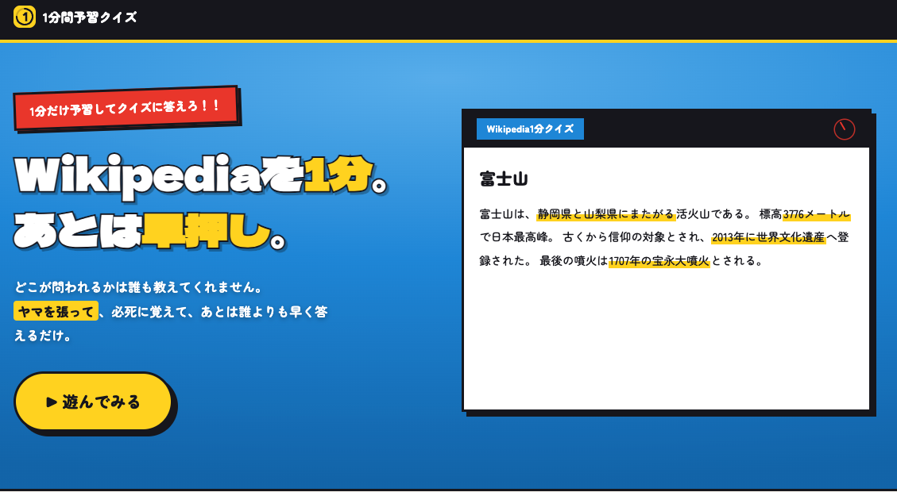
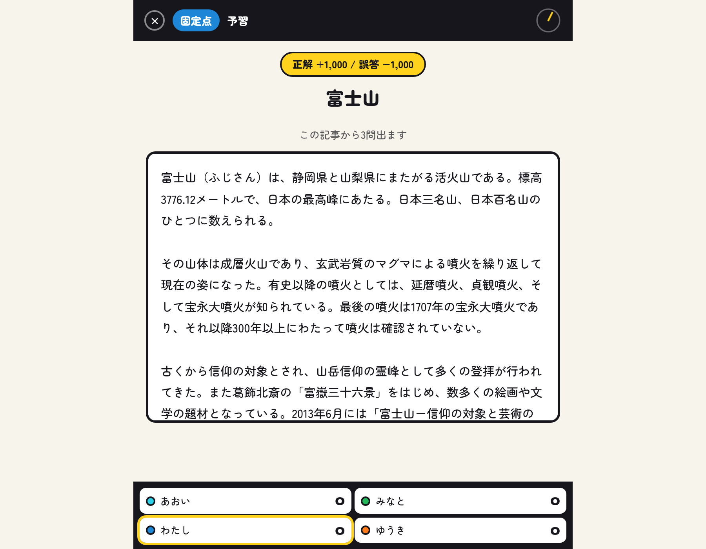
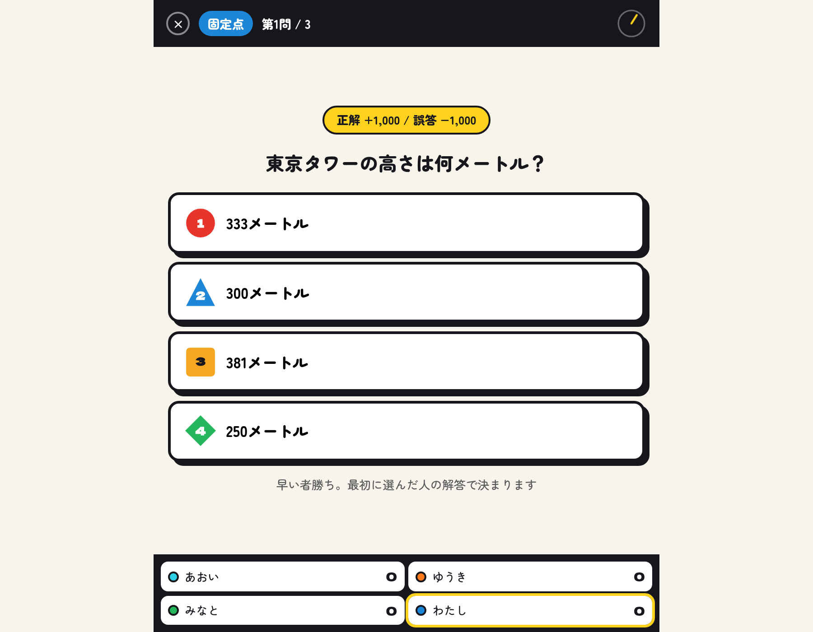
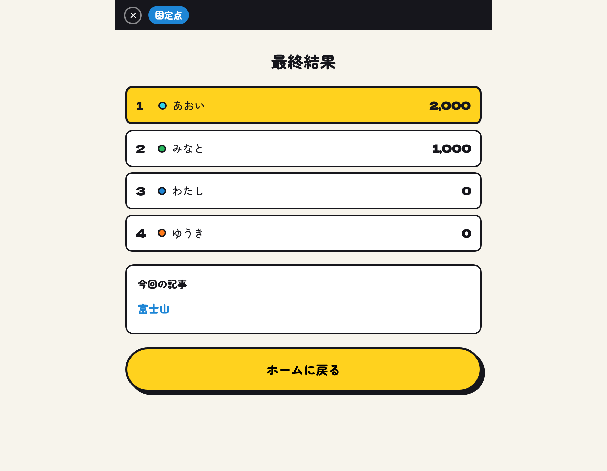
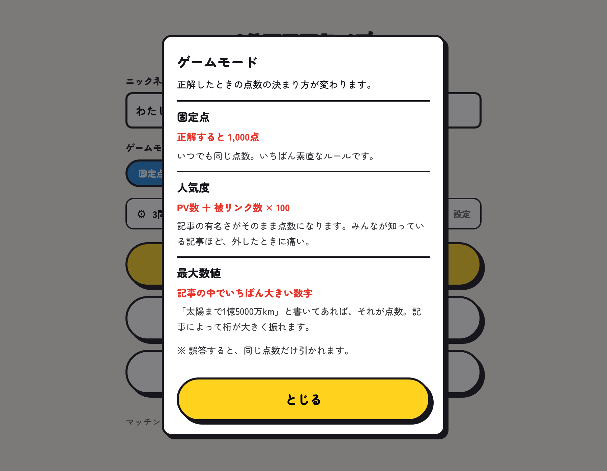
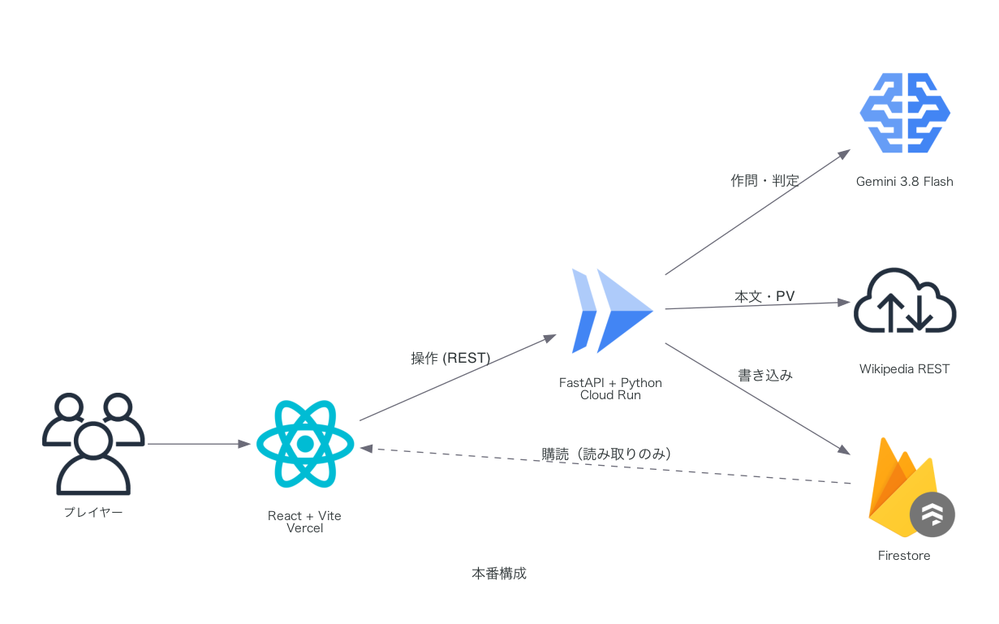

# 1分間予習クイズ

Wikipedia の記事を **1分だけ予習**して、あとは早押しでクイズに答えるオンライン対戦ゲーム。

記事は1ゲームに1本だけ。その1本を全員で読んでから、そこから3問が出ます。

> [バキ童チャンネル【ぐんぴぃ】](https://www.youtube.com/@bakibakiDT) の
> [テスト期間を思い出せ！お題のWiki記事を1分だけ予習できる山張り暗記クイズ](https://www.youtube.com/watch?v=ynQPsNxLPOo) を元ネタにしました。
> さらに、点数計算は [【数クイズ】クイズの答えがそのまま得点になるクイズで盛り上がろう！](https://www.youtube.com/watch?v=l1G6pRrfMZg) を参考にしました。
> 個人開発の非公式ファンメイド作品です。チャンネルおよび動画制作者とは関係ありません。

## 遊びかた

1. **予習（60秒）** — 渡された Wikipedia の記事を読む。全員が同じ記事を読みます。

2. **クイズ** — **記事が消えて**問題と選択肢が出る。

3. **結果** — 順位と、今回読んだ記事へのリンクが出ます。

遊びかたは3つ。

* **マッチング** — 同じルールを選んだ人と自動で対戦
* **フレンド対戦** — 6桁のルームキーを共有して、友だちと対戦
* **ひとりで遊ぶ** — 相手なし。自分のペースで記事を読んで答えるだけ

### ゲームモード

正解したときの点数の決まり方が変わります。既定は固定点。

| モード | 配点 |
| :--- | :--- |
| **固定点** | 常に 1,000 点 |
| **人気度** | 記事の PV 数 ＋ 被リンク数 × 100 |
| **最大数値** | 記事の中でいちばん大きい数字 |

 

問題数（1〜3問）と予習時間（30/60/90秒）は設定画面で変更できます。

## 技術構成

**フロントエンド**

**API**

**データ・AI**

**開発・CI**

## 今後の展望

遊べる状態にはなっていますが、代用のまま残しているところがあります。
上の2つは**早押しゲームとしての土台**なので、他より先に手を入れます。

| やること | いまの状態 | なぜ |
| :--- | :--- | :--- |
| **Firestore の直接購読**（`onSnapshot`） | 400ms ごとの API ポーリング | ミリ秒を競うゲームで、画面の切り替わりが**最大0.4秒遅れる**。読み取り回数も無駄に増える |
| **Firebase 匿名認証** | `X-Player-Id` ヘッダを信用 | 他人の ID を名乗れてしまう。セキュリティルールが前提にしている `request.auth` も埋まらない |
| **自由記述モード** | 4択のみ | 設計はしてあるが未実装。正規化で一致を見て、揺れだけ AI に判定させる |
| **記事プールの管理画面** | Firestore コンソールで `enabled` を手で切り替え | 出題に向かない記事を落とす作業が続くなら、専用の画面が要る |
| **1ゲームの問題数を増やす** | 上限3問 | 記事1本から何問まで出せて、60秒の予習で答えられるかは試していない |
